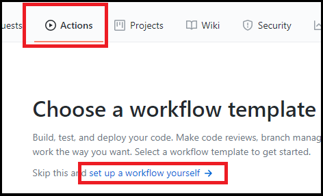
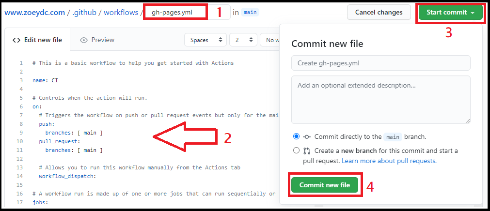
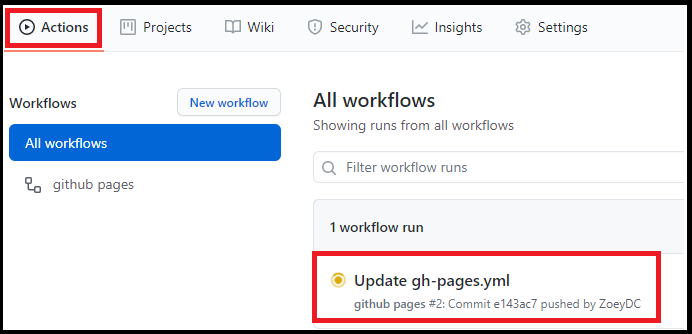
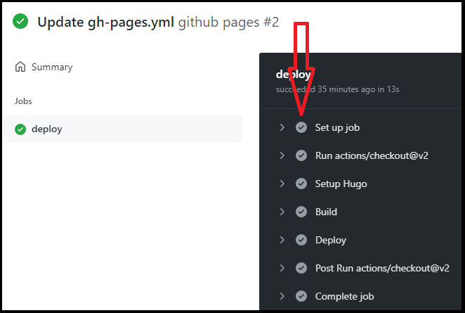
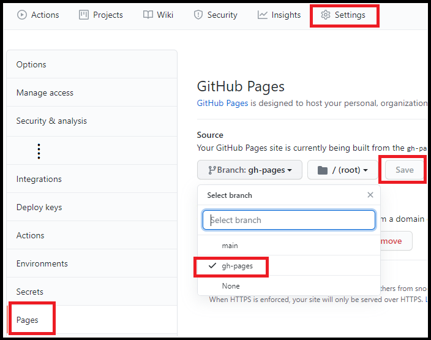

一直有建部落格的想法，也試過一些部落格平台和 WordPress，覺得平台上開站雖然方便，只要註冊帳號就好，但是版型調整方式有限，無法將網站改成符合自己心意的模樣，相較而言，WordPress 自由度很高，不過架構也相對複雜，還需要管理外掛和資料庫，有點麻煩，不太符合單純寫文章的想法，經過一番搜尋後，決定用靜態網站來架設我的部落格！
<!--more-->

雖然 GitHub Pages 推薦使用 Jekyll 生成靜態網頁，但在 Windows 環境下 Jekyll 似乎比較不友善，而 Hugo 入門相對容易、官方文件有完整的教學，還有編譯速度快等優點，眾多因素考慮下，我選擇了 Hugo。

不過還是花了一些時間才把網站搞定，所以決定要記錄一下整個架站過程，包含 (1) 本機端開發環境的建置、(2) 上傳到 Github Pages 發布網站、(3) 自訂網域，以供參考。

> 以下 `{username}` 為 GitHub 帳號名，`{主題名稱}` 為所選的佈景主題名稱，例如我的是 `zzo`。

------------------

## 本機端開發環境的建置

### 本機環境

> 作業系統：Windows 10

Hugo 可以安裝在 Windows、Linux、macOS 等作業系統，Linux 或 macOS 的安裝方式請參考[官方文件](https://gohugo.io/getting-started/installing/)。

以下建置過程預設環境已安裝 Git，也註冊 GitHub 帳號並建立名稱為 `{username}.github.io` 的 repo 了。

### 安裝套件管理器 [CHOCOLATEY](https://chocolatey.org/install)

以<mark>系統管理員</mark>身分執行 PowerShell，執行以下指令：
``` powershell
Set-ExecutionPolicy Bypass -Scope Process -Force; [System.Net.ServicePointManager]::SecurityProtocol = [System.Net.ServicePointManager]::SecurityProtocol -bor 3072; iex ((New-Object System.Net.WebClient).DownloadString('https://chocolatey.org/install.ps1'))
```

若安裝無誤，執行 `choco` 可得版本資訊，例如：

``` powershell
> choco
Chocolatey v0.10.15
Please run 'choco -?' or 'choco <command> -?' for help menu.
```

### 安裝 Hugo、建立新網站

PowerShell 繼續執行：

``` powershell
choco install hugo -confirm
```

如果選擇的主題需要擴充套件 Sass/SCSS 版本，執行：

``` powershell
choco install hugo-extended -confirm
```

若不確定是否需要擴充套件的話，可以先跳過，之後執行 `hugo server` 出現以下類似錯誤時再安裝 hugo-extended：

> ERROR 2021/05/08 16:44:51 TOCSS: failed to transform "main_parsed.scss" (text/x-scss). Check your Hugo installation; you need the **extended version** to build SCSS/SASS.

安裝完 Hugo 後，就可以建立新網站了。

``` powershell
cd myfolder ## Hugo 會在此資料夾底下新建一個資料夾
hugo new site mywebsite  ## 建立網站 & 資料夾 mywebsite
```

這個資料夾底下會建立 archetypes、content、static、themes 等資料夾，但 themes 裡面沒有預設的佈景主題，需要自己安裝。

可以到所選的主題的 GitHub repo 下載檔案解壓縮到 `themes/{主題名稱}/` 或是用 `git submodule` 安裝（以下以 zzo 主題為例）。

``` powershell
cd mywebsite ## 進入網站資料夾
git init
git submodule add https://github.com/zzossig/hugo-theme-zzo themes/zzo
```

安裝完成後，官方文件使用指令新增組態檔 config.toml：

``` powershell
echo theme = \"zzo\" >> config.toml
```

但建議直接複製範例網站，到 `themes/{主題名稱}/exampleSite/` 目錄下複製整個資料夾內容貼到 mywebsite 根目錄，再來修改組態檔，尤其有些佈景主題的組態檔結構複雜，只新增 config.toml 可能會缺少某些參數而編譯失敗。

如果要自訂 layouts 或 i18n 的內容，也從 `themes/{主題名稱}/` 下複製資料夾到根目錄後進行修改。

先來設定 config.toml 的 baseURL 和網站語言等：

``` toml
# 如果使用 GitHub Pages 預設域名
baseURL = "https://{username}.github.io/"
# 自訂域名範例
baseURL = "https://www.customdomainname.com/"

languageCode = "zh-tw"
title = "My Site Name" #自訂任意名稱
```

本機端啟動網站：

以 `hugo servre` 方式啟動網站，Hugo 會隨時偵測檔案的異動來更新網頁，到預設網址 http://localhost:1313/ 就可以看到最新的內容，關閉網站用 <kbd><kbd>CTRL</kbd>+<kbd>C</kbd></kbd> 。

``` powershell
hugo server
```

------------------

## 上傳到 Github Pages 發布網站

官方文件使用 GitHub Action 來佈署網站（方法一），但如果不希望將網站的原始碼放到網路上，可以選擇只提交最後編譯好的靜態網頁（方法二）。

### 方法一：建立 gh-pages 分支

先確定使用的 Hugo 版本，以及是否安裝擴充套件。

``` powershell
> hugo version
hugo v0.83.1-5AFE0A57+extended windows/amd64 BuildDate=2021-05-02T14:38:05Z VendorInfo=gohugoio
```

將整個資料夾 Push 到 Github repo （`{username}.github.io`）：

``` powershell
## 現在路徑為 myfolder/mywebsite/
git branch -M main
git add .
git commit -m "init mywebsite"
git remote add origin https://github.com/{username}/{username}.github.io.git
git push -u origin main
```

 再到 GitHub 新增 gh-pages.yml 檔案。





在上圖步驟 2 時，將 gh-pages.yml 內容用以下內容取代，其中 hugo-version 和 extended 再依需求進行設定：

``` yml {hl_lines=[20,21]}
name: github pages

on:
  push:
    branches:
      - main  # Set a branch to deploy

jobs:
  deploy:
    runs-on: ubuntu-18.04
    steps:
      - uses: actions/checkout@v2
        with:
          submodules: true  # Fetch Hugo themes (true OR recursive)
          fetch-depth: 0    # Fetch all history for .GitInfo and .Lastmod

      - name: Setup Hugo
        uses: peaceiris/actions-hugo@v2
        with:
          hugo-version: 'latest'  # '0.83.1'
          # extended: true  # 有用擴充套件則將 # 移除

      - name: Build
        run: hugo --minify

      - name: Deploy
        uses: peaceiris/actions-gh-pages@v3
        with:
          github_token: ${{ secrets.GITHUB_TOKEN }}
          publish_dir: ./public

```

Commit 完成後，檢查 workflow 是否順利。（之後每次 main 分支有 commit 就會有新的 workflow 自動產生，重新編譯發布網站）





全部都 ✔ 表示順利完成編譯囉。

接下來設定 GitHub Pages 要讀取 gh-pages 分支的檔案，設定完就可以到 `https://{username}.github.io` 瀏覽網站成果。



### 方法二：上傳 Public 資料夾

先以 `hugo` 產生靜態 html 檔案，成功的話會在 `mywebsite/public/` 裡面看到檔案，再將 public 資料夾 push 到 GitHub。

``` powershell
## 現在路徑為 myfolder/mywebsite/
git submodule add https://github.com/{username}/{username}.github.io.git public
hugo   # 產生靜態 html 檔案
cd public
git status  # 檢查 public 資料夾，應只看到 public 中新增的檔案
git branch -M main
git add .
git commit -m "init mywebsite"
git push -u origin main
```

參考上圖到 GitHub Pages 設定要讀取的分支為 main，就可以訪問 `https://{username}.github.io`。

------------------

## 自訂網域

GitHub 官方建議先在 GitHub 中設定 CNAME，再到 DNS 供應商設定 DNS 紀錄。

### 新增檔案 CNAME

在 GitHub 網站介面中可以設定網域名，其機制是在 Pages 的目標分支根目錄下加上 CNAME，但是這樣每次有檔案更新 CNAME 就會被覆蓋掉，要再重新設定，所以 Hugo 網站是要新增 CNAME 在 static 資料夾中，這樣編譯後，檔案會自動放在網站根目錄下，GitHub 就能以此偵測自訂域名。

CNAME 檔案（無副檔名）內容就只放自訂的網域名（例如 `www.customdomainname.com`）。

### 設定 DNS

到 DNS 供應商設定 DNS 紀錄，增加 4 筆 A Record 和 1 筆 CNAME Record（以 www 為例）。

|Type|Host|Value|
|---|---|---|
|A Record|@|185.199.108.153|
|A Record|@|185.199.109.153|
|A Record|@|185.199.110.153|
|A Record|@|185.199.111.153|
|CNAME Record|www|{username}.github.io|

### 更改 repo 名稱（非必要）

最後可以將 repo 名稱改為現在的網域，然後將 Pages 的 Enforce HTTPS 取消再重新勾選，讓 SSL 憑證重新產生。

## 結論

基本上一步一步執行就可以完成 Hugo 網站建置，如果一開始就打算自訂網域也可以先新增 CNAME 檔案以及用自訂網域作 repo 名稱來簡化步驟！

------------------
##### 參考網址：

* [Hugo Docs](https://gohugo.io/documentation/)
* [GitHub Docs 自訂網域](https://docs.github.com/en/pages/configuring-a-custom-domain-for-your-github-pages-site)

##### 其他：

* [編寫 Markdown 文件](https://markdown.tw/)


