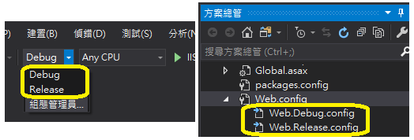
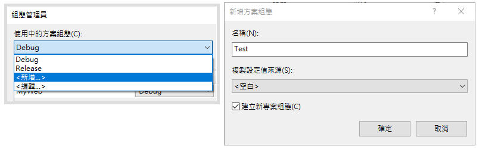
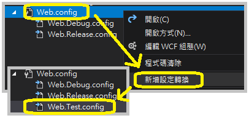
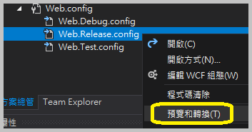
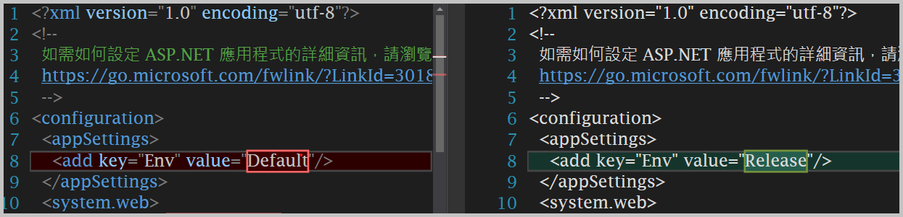

軟體從開發到⽣產的各個階段，很常遇到不同環境需要不同的組態設定（例如資料庫連線字串、系統資源對應路徑等），這些繁瑣的設定若是每次都⼿動修改實在容易出錯，⽽ Visual Studio 本⾝就有 Web.config 組態檔轉換功能，好好利⽤可以⼤⼤節約時間並降低錯誤機率，更能專注在開發本⾝。

<!--more-->

專案建立好時預設有兩個組態 Debug 和 Release，⼀般我會再建立⼀個 Test 組態在測試環境使⽤，所以本篇記錄 1. 如何新增組態和與之對應的 Web.config 設定檔，和 2. 設定 Web.config 轉換內容。

## ⼀、前置作業

1. 以 ASP.NET MVC 的預設範本建立專案（Visual Studio 2019）
2. 檢視預設組態設定：預設的 Debug 和 Release 組態各有⼀個對應的 config 檔（Web.{組態名稱}.config）



## ⼆、新增組態設定與設定檔

從「組態管理員」中新增「Test」組態後，在⽅案總管中會發現 Web.Test.config 檔案並沒有⾃動產⽣，需要⼿動「新增設定轉換」（Add Transform），檔案就會出現了。





## 三、設定不同組態發⾏時對應的 Web.config

接下來要編輯這些檔案裡⾯的內容了！了解語法之前來快速看⼀下⼀個簡單的轉換範例和呈現的效果。

### 範例與效果

就以發佈 Release 組態來說，假設原本的 Web.config 有個參數 Env：

``` xml {hl_lines=[2], linenos=false}
<appSettings> 
    <add key="Env" value="Dev"/> 
</appSettings>
```

對照在 Web.Release.config 的 Env 參數設定，除了將 value 設為 Release 外，另外加了 xdt:Transform 和 xdt:Locator 屬性（屬性詳細說明⾒[下方語法詳述](#syntax)），如下：

``` xml {hl_lines=[2], linenos=false}
<appSettings> 
    <add key="Env" value="Release" xdt:Transform="SetAttributes" xdt:Locator="Match(key)"/> 
</appSettings> 
```

實際發佈時， Env 的設定就會轉換為 Release了。

或者可以⽤內建的預覽⼯具發佈前預先檢視結果與差異處：





↑ 左邊是原始的設定檔，右邊則是轉換後的結果，差異處也都⾃動標記了。

### 語法詳述（Web.config Transformation Syntax） {#syntax}

回顧⼀下 Web.Release.config 的原始內容，或者新建的 Web.Test.config 也有相同的內容：

``` xml {hl_lines=[3,16]}
<?xml version="1.0" encoding="utf-8"?>
<!-- 如需使用 web.config 轉換的詳細資訊，請前往 https://go.microsoft.com/fwlink/?LinkId=125889 -->
<configuration xmlns:xdt="http://schemas.microsoft.com/XML-Document-Transform">
  <!--
    在下面的範例中，"SetAttributes" 轉換只會在 "Match" 定位程式找到
    值為 "MyDB" 的屬性 "name" 時，才將 "connectionString" 的值變
    更為使用 "ReleaseSQLServer"。
    
    <connectionStrings>
      <add name="MyDB" 
        connectionString="Data Source=ReleaseSQLServer;Initial Catalog=MyReleaseDB;Integrated Security=True" 
        xdt:Transform="SetAttributes" xdt:Locator="Match(name)"/>
    </connectionStrings>
  -->
  <system.web>
    <compilation xdt:Transform="RemoveAttributes(debug)" />
    <!--      
      在下面的範例中，"Replace" 轉換將會取代 web.config 檔案
      的整個 <customErrors> 區段。
      請注意，因為在 <system.web> 節點之下 
      只有一個 customErrors 區段，所以不需要使用 "xdt:Locator" 屬性。
      
      <customErrors defaultRedirect="GenericError.htm"
        mode="RemoteOnly" xdt:Transform="Replace">
        <error statusCode="500" redirect="InternalError.htm"/>
      </customErrors>
    -->
  </system.web>
</configuration>
```

和⼀般 Web.config 不同的是，它引⽤了 XML-Document-Transform 命名空間（第 3 ⾏），對應到 xdt 前置詞的使⽤（xdt:Locator 和 xdt:Transform），⽤來處理元素和屬性的轉換；xdt 前置詞在轉換後的文件中不會出現。

#### 【Locator】

⽤來定位要轉換的元素位置，為非必要屬性，若未設定時則找出所有同層級元素，再依 Transform 屬性決定轉換模式。Locator 有三種設定⽅式。

``` xml {hl_lines=[1], linenos=false}
xdt:Locator="Condition(XPath 運算式)"
範例：xdt:Locator="Condition(@name='oldname' or @providerName='oldprovider')"
```
說明：找到符合 XPath 運算式條件的元素。例如屬性 name 為 oldname 或 providerName 為 oldprovider 的所有元素。

-------------------------

``` xml {hl_lines=[1], linenos=false}
xdt:Locator="Match(屬性1,屬性2,屬性3,…)"
範例：<add name="AWLT" connectionString="newstring" providerName="newprovider" xdt:Transform="Replace" xdt:Locator="Match(name, providerName)"
```

說明：找到與所列屬性的值「皆」相同的元素。例如屬性 name 為 AWLT 且 providerName 為 newprovider 的所有元素。

-------------------------

``` xml {hl_lines=[1], linenos=false}
xdt:Locator="XPath(XPath 運算式)"
範例：<add name="AWLT2" connectionString="newstring" providerName="newprovider" xdt:Transform="Replace" xdt:Locator="XPath(/configuration/connectionStrings/add[@name='AWLT' or @providerName='oldprovider'])"/>
```

說明：完全使⽤ XPath 運算式（絕對路徑）來尋找元素，不以元素現在的位置為參考。例如即使將上述標籤放到 `<appSettings>` 元素下或直接放在 `<configuration>` 底下，其依然會找到 connectionStrings 中，符合 name 為 AWLT 或 providerName 為 oldprovider 的所有元素。

-------------------------
#### 【Transform】

說明元素屬性該如何轉換，有八種⽅式。

``` xml {linenos=false}
xdt:Transform="Replace"
```

說明：以轉換檔（Web.{組態名稱}.config）中的元素取代 Locator 屬性在 Web.config 中會找到的元素。如果找到多個元素，只會取代第⼀個。

-------------------------

``` xml {linenos=false}
xdt:Transform="Insert"
```

說明：將轉換檔的元素加入 Web.config 中 Locator 所定義的同層級的元素區域中的最後⾯。

-------------------------

``` xml {linenos=false}
xdt:Transform="InsertBefore(XPath 運算式)"
```

說明：將轉換檔的元素插入 XPath 運算式（絕對路徑）所指的元素前⾯（不是 Locator 所指的元素，在此處 Locator 沒有作⽤）。

``` xml
<authorization>
  <allow roles="Admins" xdt:Transform= "InsertBefore(/configuration/system.web/authorization/deny[@users='*'])" />
</authorization>
```

上⾯範例設定轉換時在「拒絕所有使⽤者」的項⽬前，插入「允許系統管理者」的授權。

-------------------------

``` xml {linenos=false}
xdt:Transform="InsertAfter(XPath 運算式)"
```

說明：和 InsertBefort 相反，是將轉換檔的元素插入 XPath 運算式（絕對路徑）所指的元素後⾯。

-------------------------

``` xml {linenos=false}
xdt:Transform="Remove"
```

說明：移除 Locator 找到的第⼀個元素。

-------------------------

``` xml {linenos=false}
xdt:Transform="RemoveAll"
```

說明：移除 Locator 找到的所有元素。

-------------------------

``` xml {linenos=false}
xdt:Transform="RemoveAttributes(屬性1,屬性2,屬性3,…)"
```

說明：Locator 找到元素後，移除所指定的⼀到多個屬性。如果未選擇任何屬性，則所有屬性皆移除。

``` xml
<compilation xdt:Transform="RemoveAttributes(debug)" />
```

Web.Release.config 預設就會移除 compilation 的 debug 屬性，以提⾼發⾏時程式運⾏的效能。（[原始內容](#syntax)第 16 ⾏）

-------------------------

``` xml {linenos=false}
Transform="SetAttributes(屬性1,屬性2,屬性3,…)"
```

說明：Locator 找到元素後，依照轉換檔的屬性設定所指定的⼀到多個屬性。如果未選擇任何屬性，則所有屬性皆依轉換檔進⾏設定。


##### 參考網址：

* [[Microsoft Docs] 使用 Visual Studio 的 ASP.NET Web 部署： Web.config 檔轉換](https://docs.microsoft.com/zh-tw/aspnet/web-forms/overview/deployment/visual-studio-web-deployment/web-config-transformations)
* [[Microsoft Docs] Web.config Transformation Syntax for Web Application Project Deployment](https://go.microsoft.com/fwlink/?LinkId=125889)