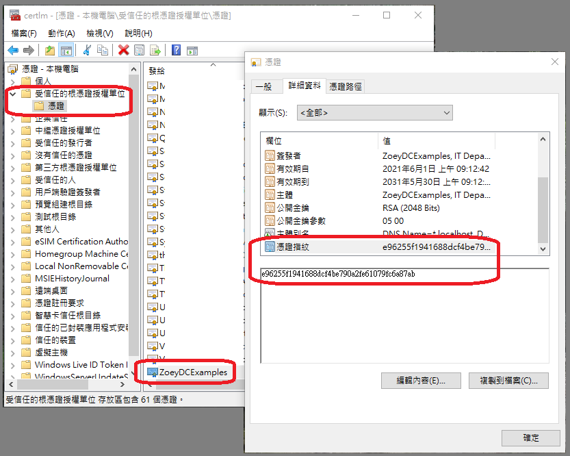

記錄⽤ certutil 新增、刪除、查詢在「本機電腦」的「個⼈」或「受信任的根憑證授權單位」存放區的 SSL 憑證的指令。

<!--more-->

## 前置作業：查詢憑證指紋（Fingerprint、Thumbprint）

本篇憑證是⽤ OpenSSL 所產⽣的 crt 和 pfx 檔，另外刪除或查詢憑證資訊時需⽤到憑證指紋，可 (1) 直接⽤ OpenSSL 取得，或 (2) 匯入憑證後進到 MMC 介⾯查詢 。

### (1) OpenSSL
將取得類似「`SHA1 Fingerprint=E9:62:55:F1:94:16:88:DC:F4:BE:79:0A:2F:E6:10:79:FC:6A:87:AB`」的⼀串文字，使⽤時取「Fingerprint=」之後的文字並將冒號去除。

以命令提示字元執行查詢：

``` cmd
REM CertificateFile 為憑證檔名稱

REM 查詢憑證指紋
> openssl x509 -in CertificateFile.crt -fingerprint -noout
SHA1 Fingerprint=E9:62:55:F1:94:16:88:DC:F4:BE:79:0A:2F:E6:10:79:FC:6A:87:AB

REM 查詢序號
> openssl x509 -in CertificateFile.crt -serial -noout
serial=6D53BD345F83AF5C3CFC1CE36C2540273C74B607
```

### (2) MMC 介面



-------------------------

## 受信任的根憑證授權單位（root）

``` cmd
REM 匯入
certutil -addstore -f "ROOT" CertificateFile.crt

REM 上述匯入憑證後，如要再匯入密鑰（⼀般不需要）
REM CertPassword 為產⽣ pfx 時輸入的密碼
certutil -f -p CertPassword -importpfx root "CertificateFile.pfx"

REM 依憑證指紋進行刪除
certutil -delstore root "e96255f1941688dcf4be790a2fe61079fc6a87ab"

REM 查詢所有受信任的根憑證
certutil -store root

REM 針對憑證指紋進⾏查詢
certutil -store root "e96255f1941688dcf4be790a2fe61079fc6a87ab"
```

-------------------------

## 個⼈存放區（my）

``` cmd
REM 匯入憑證（無密鑰）
certutil -addstore -f my CertificateFile.crt

REM 匯入憑證及密鑰到個人存放區，「同時」也會新增到受信任的根憑證授權單位 root
REM CertPassword 為產生 pfx 時輸入的密碼
certutil -f -p CertPassword -importpfx my "CertificateFile.pfx"
(certutil -f -p CertPassword -importpfx "CertificateFile.pfx")

REM 依憑證指紋進行刪除
REM 只刪除在個人存放區 "my" 的憑證，刪除在 "root" 的憑證需要另外執行
certutil -delstore my "e96255f1941688dcf4be790a2fe61079fc6a87ab"

REM 查詢所有個人憑證
certutil -store my

REM 針對憑證指紋進行查詢
certutil -store my "e96255f1941688dcf4be790a2fe61079fc6a87ab"
```

備註1：若匯入 pfx 檔到個人存放區，則在 IIS 的伺服器憑證中也可以查詢到。

備註2：若是從 IIS 伺服器憑證匯入憑證到個人存放區，那就只會在個人存放區有，不會同時新增到 root。

備註3：若是管理「目前的使用者」（Current User）的憑證，在 certutil 後加上 -user 即可，例如：`certutil -user -addstore -f my CertificateFile.crt`。「目前的使用者」的憑證會繼承「本機電腦」所有的憑證，除了在「本機電腦」的「個人存放區」的憑證（[參考連結3](https://docs.microsoft.com/en-us/windows-hardware/drivers/install/local-machine-and-current-user-certificate-stores)）。

-------------------------

##### 相關連結：

1. [[Microsoft Docs] 如何：使用 MMC 嵌入式管理單元來查看憑證](https://docs.microsoft.com/zh-tw/dotnet/framework/wcf/feature-details/how-to-view-certificates-with-the-mmc-snap-in)
2. [[Microsoft Docs] certutil](https://docs.microsoft.com/zh-tw/windows-server/administration/windows-commands/certutil)
3. [[Microsoft Docs] Local Machine and Current User Certificate Stores](https://docs.microsoft.com/en-us/windows-hardware/drivers/install/local-machine-and-current-user-certificate-stores)
