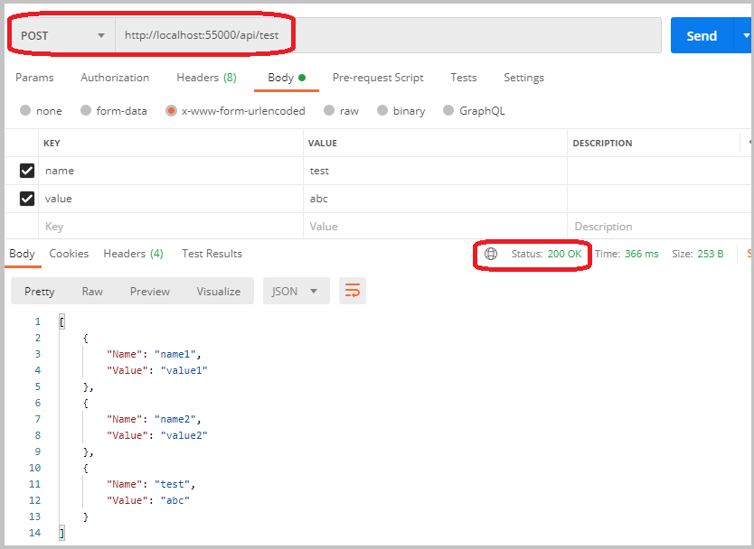
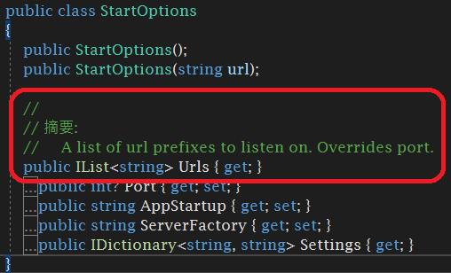

當桌⾯應⽤程式需要網路資源時，可以⽤ HttpClient 或 WebClient 等發送 HTTP 請求，但有時反過來想要開放桌⾯程式的資源供外界使⽤呢？這時就可以⽤ Self Host 的⽅式，不需要依附 IIS 就可以在程式裡掛載 Web API，為程式和外界聯繫提供⼀個管道。

<!--more-->

本篇是記錄在 Console 程式中如何使⽤ Microsoft.AspNet.WebApi.OwinSelfHost 建置 Web API，包含使⽤ HTTPS 網址、繫結多個 IP 或域名、啟⽤ CORS 等，最後補充了管理 SSL 憑證相關指令與 Windows Service 中啟動 Web API 的程式碼。


## 一、系統環境

* Windows 10
* Visual Studio 2019
* .NET Framework 4.7.2

## ⼆、建立 Startup.cs，Web API 的進入點

⾸先，安裝套件：

> Install-Package Microsoft.AspNet.WebApi.OwinSelfHost -Version 5.2.7

（OWIN 為 .NET Framework 4.5 以上使⽤， 4.0 ⽤ [Microsoft.AspNet.WebApi.SelfHost 裝載 Web API](https://docs.microsoft.com/zh-tw/aspnet/web-api/overview/older-versions/self-host-a-web-api)）

接著新增類別（或 OWIN 啟動類別）Startup.cs，設定路由規則，讓 Web API 以此規則在 OWIN 上運⾏。

``` csharp {hl_lines=["15-20",23]}
using System.Web.Http;
//using System.Web.Http.Cors;
using Microsoft.Owin;
using Owin;

[assembly: OwinStartup(typeof(SelfHostConsole.Startup))]
namespace SelfHostConsole
{
    public class Startup
    {
        public void Configuration(IAppBuilder app)
        {
            // 如需如何設定應用程式的詳細資訊，請瀏覽 https://go.microsoft.com/fwlink/?LinkID=316888
            // Configure Web API for self-host. 
            HttpConfiguration config = new HttpConfiguration();
            config.Routes.MapHttpRoute(
                name: "DefaultApi",
                routeTemplate: "api/{controller}/{id}",
                defaults: new { id = RouteParameter.Optional }
            );
            //Enable CORS
            //config.EnableCors(new EnableCorsAttribute("*", headers: "*", methods: "*"));
            app.UseWebApi(config);
        }
    }
}
```

如果網站需要跨域資源共享（CORS），則需安裝 CORS 套件，並啟用上述第 2 和 22 ⾏：

> Install-Package Microsoft.AspNet.WebApi.Cors -Version 5.2.7

接下來在 Program.cs 裡設定執⾏程式時啟動 Web API host：

``` csharp {hl_lines=["10-16"]}
using Microsoft.Owin.Hosting;
using System;

namespace SelfHostConsole
{
    class Program
    {
        static void Main(string[] args)
        {
            string baseAddress = "http://localhost:55000/";
            Console.WriteLine("Start OWIN host ...");
            using (WebApp.Start<Startup>(url: baseAddress))
            {
                Console.WriteLine("Wait for a request ...");
                Console.ReadLine();
            }
        }
    }
}
```

此時若以 Postman 測試 Get 訪問 `http://localhost:55000/` 會收到 `404 Not Found`，⽽不是出現 `Error: connect ECONNREFUSED 127.0.0.1:55000` 這樣的訊息，表⽰這時候 Web API 的基本架構已經完成了。

## 三、加入 Controller

依照習慣取代配置（Convention over Configuration）的原則，Controller 以 Controller 結尾就可以被找到，這邊簡單加個 TestController。

``` csharp
using System.Collections.Generic; 
using System.Web.Http; 
 
namespace SelfHostConsole 
{ 
    public class TestController : ApiController 
    { 
        private static List<MyModel> list = new List<MyModel>() 
        { 
            new MyModel(){Name="name1", Value="value1"}, 
            new MyModel(){Name="name2", Value="value2"}, 
        }; 
 
        // GET api/test 
        public IEnumerable<MyModel> Get() 
        { 
            return list; 
        } 
 
        // GET api/test/1 
        public MyModel Get(int id) 
        { 
            if (id < 0 || id >= list.Count) 
                return null; 
            return list[id]; 
        } 
 
        // POST api/test 
        public IEnumerable<MyModel> Post([FromBody] MyModel newData) 
        { 
            list.Add(newData); 
            return list; 
        } 
    } 
 
    public class MyModel
    { 
        public string Name { get; set; } 
        public string Value { get; set; } 
    } 
}
```

這樣 Web API 就可以運作了。

⽤ Postman 測試⼀下，運作正常。



如果 Postman 收到以下的訊息，確認⼀下是否有將 Controller 設為 public class。

``` json
{
    "Message": "No HTTP resource was found that matches the request URI 'http://localhost:55000/api/test'.",
    "MessageDetail": "No type was found that matches the controller named 'test'."
}
```

## 四、安裝 SSL 憑證，啟⽤ HTTPS

若要啟⽤ HTTPS，程式碼網址部分直接修改成 https 即可。除此之外環境要安裝 SSL 憑證。

### 1. 建立 SSL 憑證

這邊⽤ OpenSSL 建立憑證，取得 crt 和 pfx 檔後，匯入⾃簽憑證到「受信任的根憑證授權單位」和「伺服器憑證」。

以系統管理員⾝分執⾏命令提⽰字元，其中 CertPassword 取代為在建立 pfx 檔時所輸入的密碼。：

``` cmd
certutil -f -p CertPassword -importpfx "server.pfx"
```

### 2. 取得憑證指紋（Thumbprint）

在「開始」功能表搜尋 mmc 或 certlm.msc ，進到憑證管理介⾯，在「個⼈」或「受信任的根憑證授權單位」中找到匯入的憑證名稱，快點兩下進到「詳細資料」畫⾯，將憑證指紋記錄下來。（[也可⽤ openssl 取得憑證指紋](../2021-06-04-certutil-store-ssl))


### 3. 將 SSL 憑證和 Port 綁定

以系統管理員⾝分執⾏命令提⽰字元，其中 certhash 為上⼀步驟得到的憑證指紋，appid 則填入任意⼀組 GUID。：

``` cmd
netsh http add sslcert ipport=0.0.0.0:55000 certhash=e96255f1941688dcf4be790a2fe61079fc6a87ab appid={bd59f744-97e7-4b9b-b100-9ab561e3bd5a}
```

### 4. 進⾏測試

Postman 測試時可能會出現 `Error: self signed certificate`，是因為憑證檢核時[⾃簽憑證無法過關](https://blog.darkthread.net/blog/postman-cant-test-iisexress/)，需要在設定裡將「SSL certificate verification」關閉（建議測試完後恢復進⾏檢核）。正常來說可以得到和[先前](#postman)⼀樣的結果，除了網址 http 現在換成 https。

## 五、繫結多個 IP 或域名

在 Program.cs 啟動 Web API 是使用 `WebApp.Start(url: baseAddress)` 來設定網址，觀察它的 Metadata，`Start` 方法除了傳入 url 網址外，還有另一個傳入 `StartOptions` 的多載，裡面有個 `Urls` 的 Property，說明為「A list of url prefixes to listen on. Overrides port.」，所以就是從這邊下手了。



``` csharp {hl_lines=["5-7",10]}
class Program
{
	static void Main(string[] args)
	{
		StartOptions options = new StartOptions();
		options.Urls.Add("https://localhost:55000/");
		options.Urls.Add("http://localhost:55001/");

		Console.WriteLine("Start OWIN host ...");
		using (WebApp.Start<Startup>(options: options))
		{
			Console.WriteLine("Wait for a request ...");
			Console.ReadLine();
		}
	}
}
```

這樣就完成了多個 IP 的繫結。

## 補充

### 1. SSL 憑證安裝刪除查詢

參考「[⽤ certutil 新增刪除查詢 SSL 憑證](../2021-06-04-certutil-store-ssl)」。

### 2. SSL 繫結 Port 及刪除、查詢繫結

``` cmd
netsh http add sslcert ipport=0.0.0.0:55000 certhash=e96255f1941688dcf4be790a2fe61079fc6a87ab appid={bd59f744-97e7-4b9b-b100-9ab561e3bd5a}
netsh http delete sslcert ipport=0.0.0.0:55000
netsh http show sslcert
netsh http show sslcert ipport=0.0.0.0:55000
```

### 3. 在 Windows Service 中啟動 Web API

覆寫 `OnStart` 與 `OnStop` 方法時分別建立和釋放 Web API 資源。

``` csharp {hl_lines=[9,17,"22-25"]}
using Microsoft.Owin.Hosting;
using System;
using System.ServiceProcess;

namespace SelfHost
{
    public partial class SelfHostService : ServiceBase
    {
        private IDisposable _server = null;
        public SelfHostService()
        {
            InitializeComponent();
        }

        protected override void OnStart(string[] args)
        {
            _server = WebApp.Start<Startup>("https://localhost:55000/");
        }

        protected override void OnStop()
        {
            if (_server != null)
            {
                _server.Dispose();
            }
            base.OnStop();
        }
    }
}
```

-------------------------

##### 相關連結：

1. [[Microsoft Docs] ⾃我裝載 ASP.NET Web API 1 （C#）](https://docs.microsoft.com/zh-tw/aspnet/web-api/overview/older-versions/self-host-a-web-api)
2. [[Microsoft Docs] 使⽤ OWIN ⾃我裝載 ASP.NET Web API](https://docs.microsoft.com/zh-tw/aspnet/web-api/overview/hosting-aspnet-web-api/use-owin-to-self-host-web-api)
3. [[Microsoft Docs] 如何：使⽤ MMC 嵌入式管理單元來查看憑證](https://docs.microsoft.com/zh-tw/dotnet/framework/wcf/feature-details/how-to-view-certificates-with-the-mmc-snap-in)
4. [[Microsoft Docs] 作法：使⽤ SSL 憑證設定連接埠](https://docs.microsoft.com/zh-tw/dotnet/framework/wcf/feature-details/how-to-configure-a-port-with-an-ssl-certificate)
5. [[WILL保哥] 如何使⽤ OpenSSL 建立開發測試⽤途的⾃簽憑證 (Self-Signed Certificate)](https://blog.miniasp.com/post/2019/02/25/Creating-Self-signed-Certificate-using-OpenSSL)
6. [[⿊暗執⾏緒] PostMan 無法連線 IIS Express 網站](https://blog.darkthread.net/blog/postman-cant-test-iisexress/)
7. [OWIN WebAPI Service example](https://github.com/danesparza/OWIN-WebAPI-Service)
