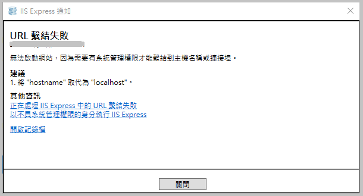
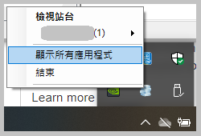
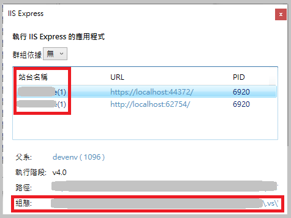
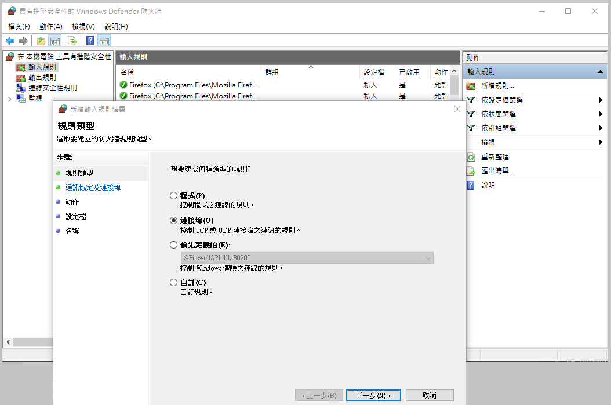
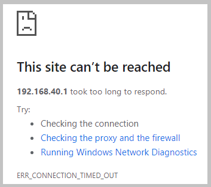
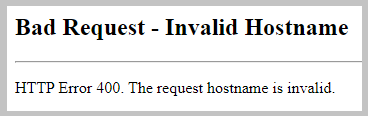

有時後開發中需要測試不同環境或裝置開啟網站的差異，而為了方便偵錯，可以讓 IIS Express 啟動的網站允許外部連線進來。

## ⼀、系統環境

* Windows Server 2012
* Visual Studio 2012

## 二、取得本機端 IP

以 `ipconfig` 取得本機端的 IP（例如 192.168.40.1）

## 三、以系統管理員⾝分開啟 Visual Studio

一定要用系統管理員⾝分執⾏ Visual Studio，因為更改成非 localhost 的繫結設定後需要系統管理員權限才能執⾏ IIS Express。

如果沒有用系統管理員執行，可能會跳出以下訊息：



## 四、設定 applicationhost.config

開始偵錯，IIS Express執⾏後，取得網站名稱，並找到組態檔 applicationhost.config。





>（VS 2012 在「我的文件」中：「%USERPROFILE%\My Documents\IISExpress\config\applicationhost.config」；VS 2019 在「⽅案資料夾\.vs\專案名稱\config\applicationhost.config」。）

開啟檔案後，依照網站名稱找到對應的設定，修改原本的繫結設定，將 localhost 改成本機的 IP（例如 `bindingInformation="*:62754:localhost"` 改為 ``bindingInformation="*:62754:192.168.40.1"``），然後存檔。

``` xml {hl_lines=["6-7"]}
<site name="TestSite(1)" id="3"> 
  <application path="/" applicationPool="Clr4IntegratedAppPool"> 
    <virtualDirectory path="/" physicalPath="C:\TestSite\TestSite" /> 
  </application> 
  <bindings> 
    <binding protocol="http" bindingInformation="*:62754:192.168.40.1" /> 
    <binding protocol="https" bindingInformation="*:44372:192.168.40.1" /> 
  </bindings> 
</site> 
```

## 五、設定輸入規則

控制台→Windows防火牆→進階設定→輸入規則→新增規則→選擇連接埠→設定要開放的
port（以上面例子來說就是 62754 和 44372）→完成設定



## 六、重新啟動網站

關閉 IIS Express，結束偵錯（但不要關閉 VS），然後再重新進入偵錯，啟動網站。

## 七、手機端測試連線

手機使⽤對應的 URL，例如 `http://192.168.40.1:62754`，即可瀏覽。

> 個⼈偏好，在測試完成後，會將 applicationhost.config 繫結改回來 localhost，不然重開專案後，繫結可能重設，網站名稱和編號會⼀直增加 （例如 TestSite → TestSite(1) → TestSite(2) → …）

## 備註：狀況排解

以下是我設定時曾經遇到的狀況和解決方法：

狀況⼀、The site can’t be reached.（無法連上這個網站） → 檢查輸入規則是否設定成功。



狀況⼆、Bad Request – Invalid Hostname → 檢查 applicationhost.config 的繫結設定




##### 相關連結：

1. [Using Custom Domains With IIS Express](https://stackoverflow.com/questions/4709014/using-custom-domains-with-iis-express)