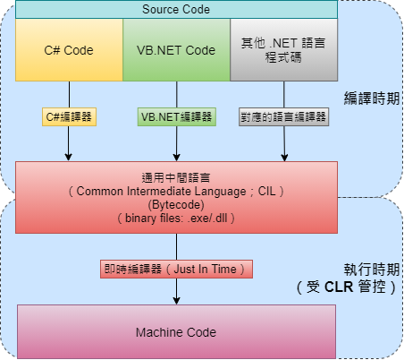
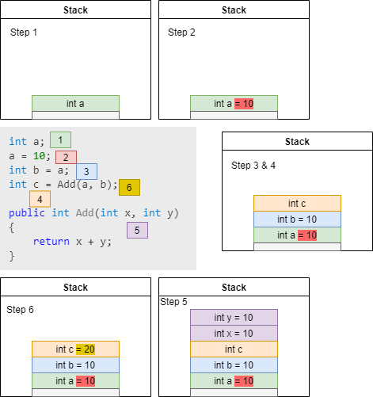
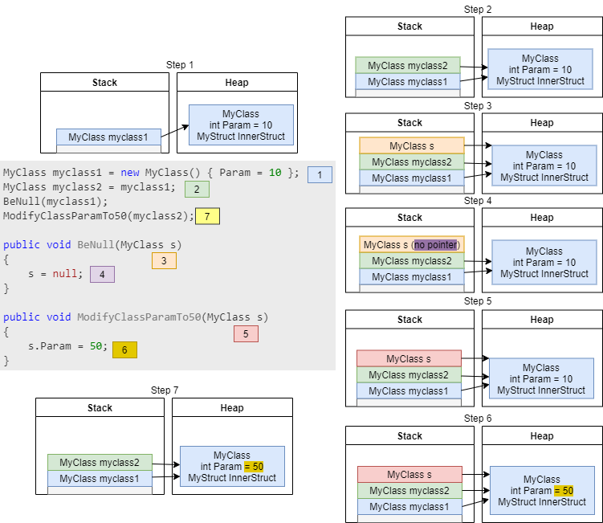
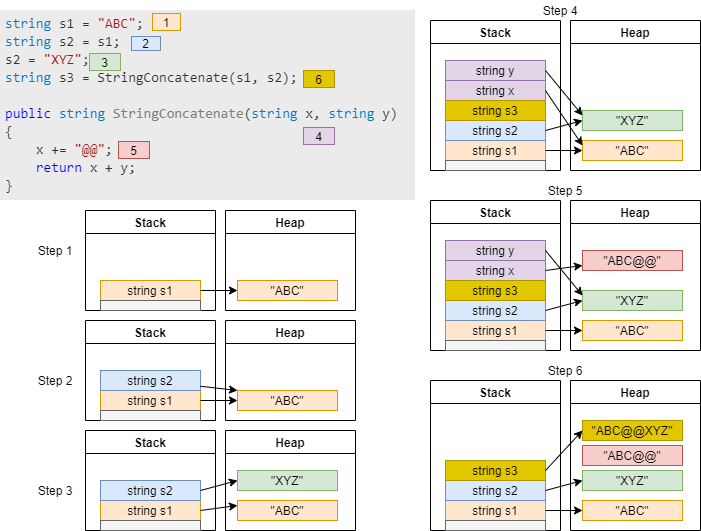
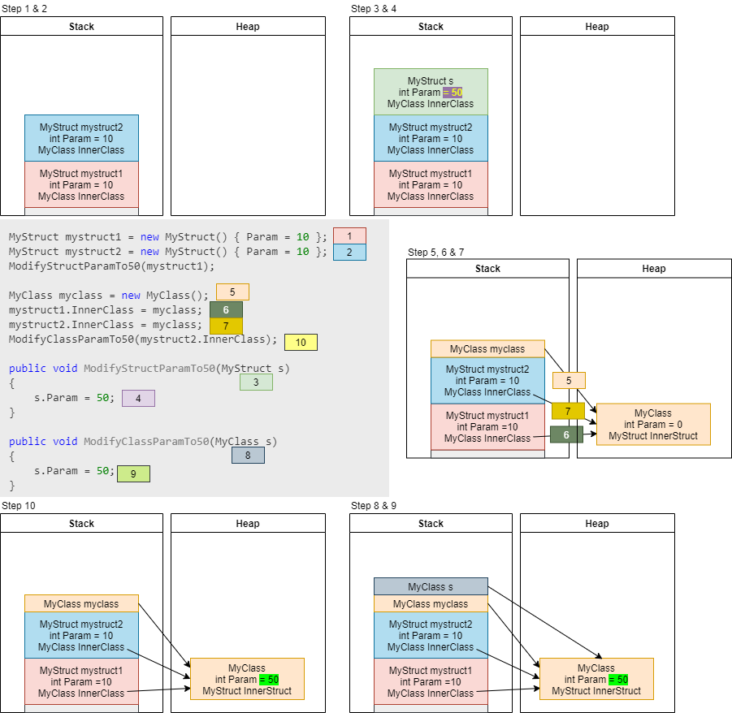
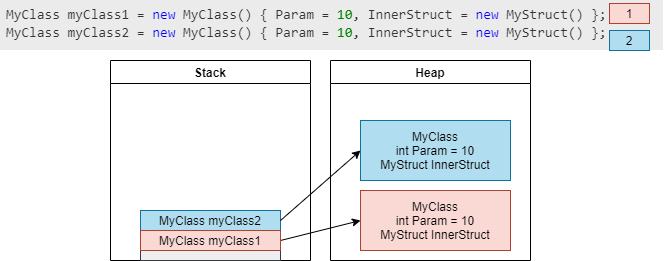
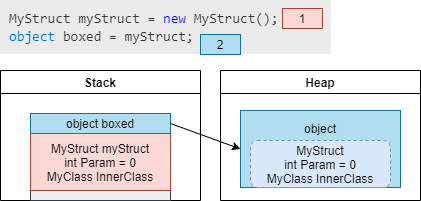
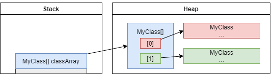
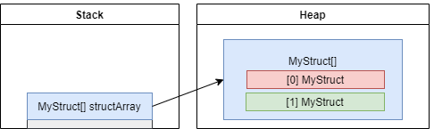

因為過去基礎沒打好😆，最近在用 struct 時一直有些疑慮，決定還是將這部分好好弄清楚，所以就整理了這篇筆記，記錄 .NET「通用語言運行庫」（CLR；Common Language Runtime）如何管理和配置記憶體資源，來存取程式運行中用到的實值型別（value types）或參考型別（reference types）變數資料。

## .NET 和 CLR

簡單而言，CLR 就是讓 .NET 應用程式可以運作的虛擬機器。

不同 .NET 語言的來源程式碼，被各自的編譯器編譯後，都會編譯成 CIL（通用中間語言）程式碼，儲存在二進制檔案（.exe/.dll）中。當二進制檔案被執行時，CLR 才會將 CIL 即時編譯成適用於該系統環境的機器程式碼；同時 CLR 也管理和作業系統溝通與安全性問題等諸多事項，而記憶體管理就是其中一項。



因為 .NET 程式需要依靠 CLR 來運行，是受 CLR 所管控，所以也將這些稱為受控程式碼（managed code）；但如果是 C/C++ 程式，所有和系統環境的溝通都是由程式碼自己處理，故稱為非受控程式碼（unmanaged code）。

## 記憶體管理

.NET 程式執行時，CLR 會保留一塊連續的記憶體空間供程式使用（不受其他程式干擾），這個記憶體空間將劃分為三個區塊：`Static`、`Stack` 和 `Heap`。

### Static（靜態）- High Frequency Heap

> 1. 存放<mark>靜態成員</mark>、<mark>靜態方法</mark>。
> 2. 程式執行期間一直佔用記憶體空間，不會釋出。

程式載入後，每一次遇到遇到新的靜態成員或方法（或者所屬類別的 instance 第一次建立前），就會配置 Static 區塊的記憶體給那個靜態成員或方法使用。這在程式執行期間只會配置這麼一次，之後就一直占用同樣的記憶體位址，直到程式結束才會釋出，所以靜態成員或方法多時，會占用比較多的記憶體空間。

實作上，.NET 將 Static 區塊放在 High Frequency Heap。

### Stack（堆疊）

> 1. 存放<mark>區域變數</mark>，如果變數為實值型別，其**值**也存放在 Stack 中，如果變數為參考型別，其**指標**（Pointer；Heap 記憶體位址）存放在 Stack 中。
> 2. 變數宣告後開始占用記憶體，離開變數可見範圍完成生命週期後，記憶體空間自動回收。

Stack 是以「後進先出」的陣列結構來存取資料。隨著程式執行緒方向前進，每宣告一個區域變數時，這個變數就會在 Stack 中「堆疊」，而在離開函式變數不再使用後，記憶體空間會自動釋放。所以先宣告的變數的記憶體空間會最後釋放，最後宣告的變數會最先回收（Last In, First Out；LIFO）。儲存在 Stack 的資料其生命週期是可以預測的，不須特意管理記憶體的釋放。

但因為記憶體空間是有限的，程式沒有寫好而造成無限迴圈或無限遞迴時，Stack 空間不足會發生溢位錯誤（StackOverflowException）。

### Heap（堆積）- GC Heap

> 1. 存放<mark>參考型別變數</mark>的**值**（物件本身）和封箱的（Boxed）實值型別變數等。
> 2. 當參考型別的物件建立時，開始占用記憶體，直到空間不足時 GC 釋放沒有指標指向的物件。無法預測生命週期。

.NET 中這個區塊由 Garbage Collector（GC；垃圾回收；記憶體回收）來提供自動記憶體管理服務。自動記憶體管理（[Automatic Memory Management](https://docs.microsoft.com/en-us/dotnet/standard/automatic-memory-management)）可以避免一些常見的問題，例如忘記釋放不再使用的物件而造成記憶體流失（[Memory Leak](https://zh.wikipedia.org/wiki/%E5%86%85%E5%AD%98%E6%B3%84%E6%BC%8F)，也就是 Stack 中的變數和指標已經移除了，但 Heap 中變數對應的物件沒有被釋放），或嘗試存取已經被釋放的物件而造成錯誤等。

當第一個參考型別的實例建立（new）時，GC 會依據所需的記憶體大小在 Heap 根位址（base address）上開闢一個空間存放物件，接下來下一個物件的存放位置會與上一個相鄰，下一個再與上一個相鄰...，依照這個原則依序存放直到沒有足夠的空間為止。

當 GC 估計記憶體空間不足時，就會將不再使用、沒有指標指向的物件回收，釋放空間，然後將具有指標的物件重新排序壓縮（以複製刪除方式），將可用的空間挪到一起，供後續新增的物件使用。程式中也可以使用 `GC.Collect()` **建議** GC 進行回收（不代表 GC 會馬上處理），但通常不需要這麼做。

Heap 中有另外一個區塊用來存放大型物件（Large Object Heap），在這個區塊中，一樣是由 GC 管控記憶體配置，但是當大型物件回收後，其他的物件不會重新排序，以避免大型物件的搬移降低效能。

當程式建立大型陣列或資料集合（超過 2GB），CLR 無法為他們配置足夠的連續記憶體空間時，會產生 OutOfMemoryException 例外狀況。更多可能導致 OutOfMemoryException 的原因可以參考[微軟文件](https://docs.microsoft.com/zh-tw/dotnet/api/system.outofmemoryexception?view=net-5.0)。

### Stack vs Heap

|項目|Stack|Heap|
|---|---|---|
|特點|靜態記憶體配置；記憶體配置方式具連續性、可預測|動態記憶體配置；依使用者需求配置記憶體，空間上不需具連續性|
|結構特性|記憶體陣列；後進先出（LIFO）的資料結構|記憶體區塊，依需求分割儲存各種資料物件，物件存取不存在順序關係|
|比喻|疊盤子，最後放上去的會最先拿起來|相片牆，照片可任意拿取或重新排列|
|儲存的資料|實值型別，和參考型別的指標|參考型別的值和封箱的實值型別變數等|
|記憶體配置速度|快|較慢|
|可否改變儲存長度|不能|可以|
|存取性質|不能跨執行緒存取|可跨執行緒存取|
|何時釋放空間（生命週期）|區域變數離開存取範圍後|沒有指標指向此物件後，由 GC 判斷 Heap 使用需求來規劃清除時機|
|例外狀況|StackOverflowException|OutOfMemoryException|

## 圖解資料型別與記憶體配置

原則：實值型別的值會與對應的變數或成員名稱存放相同記憶體位置，參考型別的值會存在 Heap 中，儲存其對應變數或成員名稱的地方會有這個值的指標。

以下共用的 struct 和 class 程式碼：
``` csharp
struct MyStruct
{
    public int Param { get; set; }
    public MyClass InnerClass { get; set; }
}

class MyClass
{
    public int Param { get; set; }
    public MyStruct InnerStruct { get; set; }
}
```

### 1. 實值型別（簡單型別）區域變數
``` csharp
int a;
a = 10;
int b = a;
int c = Add(a, b);

public int Add(int x, int y)
{
    return x + y;
}
```




### 2. 參考型別（類別）區域變數
``` csharp
MyClass myclass1 = new MyClass() { Param = 10 };
MyClass myclass2 = myclass1;
BeNull(myclass1);
ModifyClassParamTo50(myclass2);

public void BeNull(MyClass s)
{
    s = null;  //不會影響原本的物件的指標
}

public void ModifyClassParamTo50(MyClass s)
{
    s.Param = 50;
}
```




### 3. 參考型別（字串）區域變數
``` csharp
string s1 = "ABC";
string s2 = s1;
s2 = "XYZ";
string s3 = StringConcatenate(s1, s2);

public string StringConcatenate(string x, string y)
{
    x += "@@";
    return x + y;
}
```




### 4. Struct 區域變數（含參考型別成員）
``` csharp {hl_lines=[1,2,5,8,9,11,14]}
MyStruct mystruct1 = new MyStruct() { Param = 10 };
MyStruct mystruct2 = new MyStruct() { Param = 10 };
Console.WriteLine("4-1. mystruct2.Equals(mystruct1)：" + mystruct2.Equals(mystruct1));   //True

ModifyStructParamTo50(mystruct1);   //作為引數會複製一份資料給方法使用
Console.WriteLine("4-2. mystruct1.Param = " + mystruct1.Param);   //10

MyClass myclass = new MyClass();
mystruct1.InnerClass = myclass;
Console.WriteLine("4-3. mystruct2.Equals(mystruct1)：" + mystruct2.Equals(mystruct1));   //False
mystruct2.InnerClass = myclass;
Console.WriteLine("4-4. mystruct2.Equals(mystruct1)：" + mystruct2.Equals(mystruct1));   //True

ModifyClassParamTo50(mystruct2.InnerClass);
Console.WriteLine("4-5. mystruct1.InnerClass.Param = " + mystruct1.InnerClass.Param);   //50
Console.WriteLine("4-6. mystruct2.Equals(mystruct1)：" + mystruct2.Equals(mystruct1));   //True
Console.WriteLine("4-7. myclass.Equals(mystruct1.InnerClass)：" + myclass.Equals(mystruct1.InnerClass));   //True


public void ModifyStructParamTo50(MyStruct s)
{
    s.Param = 50;  //修改複製來的資料，不影響原本 Struct 的值
}

public void ModifyClassParamTo50(MyClass s)
{
    s.Param = 50;
}
```




### 5. 參考型別區域變數（含 Struct 成員）
``` csharp
MyClass myClass1 = new MyClass() { Param = 10, InnerStruct = new MyStruct() };
MyClass myClass2 = new MyClass() { Param = 10, InnerStruct = new MyStruct() };
Console.WriteLine("5-1. myClass2.Equals(myClass1)：" + myClass2.Equals(myClass1));   //False
```




### 6. 實值型別封箱 Boxing
``` csharp
MyStruct myStruct = new MyStruct();
object boxed = myStruct;
```




### 7. 類別陣列
``` csharp
MyClass[] classArray = new MyClass[] { new MyClass(), new MyClass()};
```




### 8. Struct 陣列
``` csharp
MyStruct[] structArray = new MyStruct[] { new MyStruct(), new MyStruct()};
```




## 總結：Struct 使用時機

和 class 比較，其實 struct 的限制頗多，除了作為實值型別需考量其記憶體的使用外，其他還有 struct 只能實作介面，不能繼承或抽象化，所以只有有限的多型性。

了解 struct 的特性後，總算可以歸納 struct 使用的時機了😂

> Struct 使用時機：
> 1. 會一直重複使用的小型的資料結構
> 2. 類別中希望限定只能唯讀的成員
> 3. 作為方法引數，但不希望值本身受方法運算結果影響
> 4. 應盡量避免 Boxing / Unboxing

##### 相關連結：

1. [[C#Corner] Stack Vs Heap Memory - C#](https://www.c-sharpcorner.com/article/stack-vs-heap-memory-c-sharp/)
1. [[C#Corner] Working With Static In C#](https://www.c-sharpcorner.com/article/working-with-static-in-c-sharp/)
1. [[CODE PROJECT] Static Keyword Demystified](https://www.codeproject.com/Articles/15269/Static-Keyword-Demystified)
1. [[stack overflow] Where are all the static members stored?](https://stackoverflow.com/questions/38612009/where-are-all-the-static-members-stored)
1. [[Micorsoft Docs] Automatic Memory Management](https://docs.microsoft.com/en-us/dotnet/standard/automatic-memory-management)
1. [[Micorsoft Docs] C# 型別系統 ](https://docs.microsoft.com/zh-tw/dotnet/csharp/fundamentals/types/)
1. [Struct V.S Class 兩者之間差異](https://dotblogs.com.tw/daniel/2018/02/22/135011)
1. [Why is List<Struct> 15 Times Faster to Allocate than List<Class> in C#](https://levelup.gitconnected.com/why-is-list-struct-is-15-times-faster-to-allocate-than-list-class-17f5f79889ae)
1. [[Book] Head First C#, 4th Edition](https://www.amazon.com/-/zh_TW/Andrew-Stellman-ebook-dp-B08PQ7CVPT/dp/B08PQ7CVPT/ref=mt_other?_encoding=UTF8&me=&qid=)


