關於安裝檔的建立，在這兩篇文章「[建立Installer](http://vito-note.blogspot.com/2012/02/installer.html)」和「[在Visual Studio將Windows Service打包成安裝檔](https://catchtest.pixnet.net/blog/post/30397914-%E5%9C%A8visual-studio%E5%B0%87windows-service%E6%89%93%E5%8C%85%E6%88%90%E5%AE%89%E8%A3%9D%E6%AA%94)」有找到滿詳細的說明，這裡主要是記錄製作安裝檔時其他可能用到的功能。

> 以下假設 MyExeProject 是要安裝的目標程式專案名

## VS 2017/2019 建立 Installer Project

因為 Installer Project 在 Visual Studio 2017/2019 不是內建的專案類型，需要另外安裝 Microsoft Visual Studio Installer Projects。

> Visual Studio 2017：工具 → 擴充功能和更新。
> Visual Studio 2019：延伸模組 → 管理延伸模組。

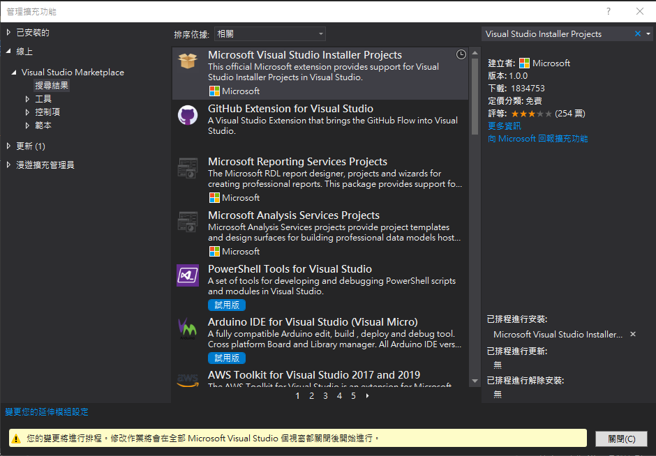

搜尋「Microsoft Visual Studio Installer Projects」下載安裝程式，等關閉 Visual Studio 後會進行安裝，之後要建立 Installer 的專案時找到「Setup Project」即可。

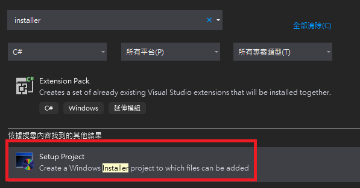


## 執行檔加入數位簽章，並打包進安裝檔

進入 MyExeProject 專案的屬性頁面，找到「簽署」，勾選「簽署 ClickOnce 資訊清單」，然後從存放區或檔案匯入簽章。

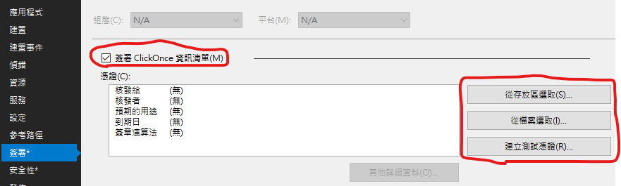

再到「安全性」頁面，勾選「啟用 ClickOnce 安全性設定」。

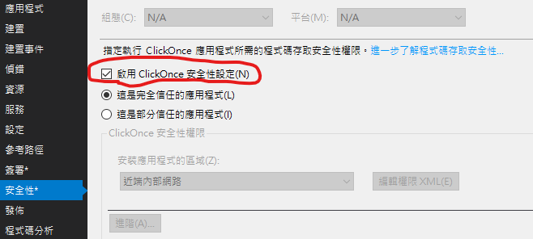

這樣程式編譯完後，在 bin 的 Debug 或 Release 內新建的資料夾 `app.publish` 中會產生已加入簽章的執行檔，但是安裝檔專案在建置時這個檔案不會自動包裝到安裝檔中，所以還需要額外進行處理。

Installer 的專案輸出其實是從 obj 資料夾中抓過來的，所以可以在安裝檔建置前，先將 obj 中的檔案取代成已經加入數位簽章的檔案，再進行建置。

就用 PreBuildEvent 來處理。

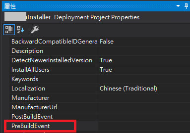

``` cmd
REM 只在 Release 組態時進行
if "$(Configuration)" == "Release" (
cd "$(ProjectDir)"
cd ..
copy /Y "MyExeProject\bin\$(Configuration)\app.publish\MyExeProject.exe" "MyExeProject\obj\$(Configuration)\MyExeProject.exe"
)
```


## 建立傳入引數的捷徑

在檔案系統（File System）建立捷徑後，捷徑的屬性視窗 `Arguments` 欄位填入引數即可。

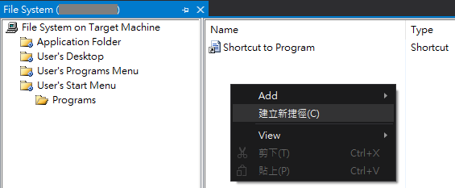

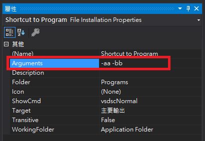


## 偵測所需的 .NET Framework 版本

如果軟體安裝前有其他必須安裝的 .NET 或 SQL 相關元件，可以在 Installer 專案的屬性頁「Prerequisties...」進行設定，如下圖：

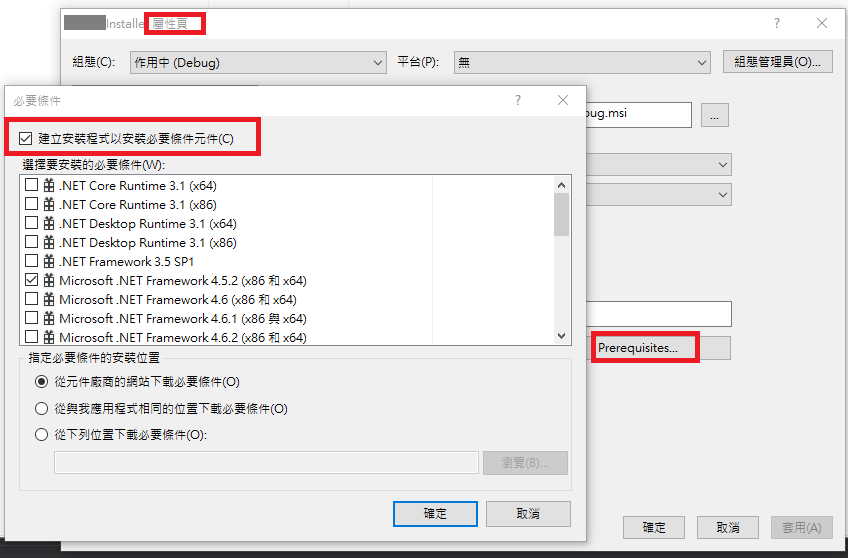

勾選「建立安裝程式以安裝必要條件元件」，即設定安裝檔建置後會一併產生 Setup.exe 檔案，要安裝時必須先點擊這個檔案，先安裝必要的元件，安裝完後會自動進入程式的安裝。

但是即使機器原本已經有裝了勾選的元件，還是會啟動必要元件的安裝程式進行安裝（至少我測試是這樣），而且這樣一來需要釋出兩個檔案：Setup.exe 和主要安裝檔 msi 檔，所以最後沒用到這個功能。

而 msi 檔本身可以設定所需的啟動條件，例如 .NET Framework 版本需求等，在版本未達到時會出現提示且開啟預設的下載頁面，設定方式如下：


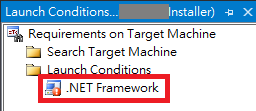

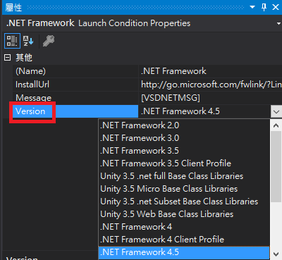

當安裝時作業環境未達到啟動條件時，會出現提示：

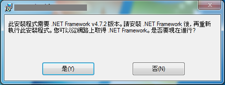

這樣安裝時只需要 msi 檔即可，而且環境達到啟動條件就不會出現提示，而是直接進到安裝程序。

除了檢查 .NET Framework 版本外，應該可以加上更複雜的啟動條件設定，如果要再深入研究，也許可以參考微軟相關文章「[Add launch conditions](https://docs.microsoft.com/en-us/previous-versions/windows/desktop/cc982261(v=vs.85))」。


## 安裝新版程式時自動取代舊版本

步驟如下：

1. 設定 MyExeProject 的版本資訊：進到專案屬性→應用程式頁面→組件資訊，設定「組件版本」和「檔案版本」為新的版本號（設定前三碼，第四碼忽略），例如 3.1.2 版如下：

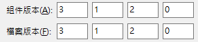

2. 設定 Installer 專案的版本：專案屬性欄位 Version 設定和步驟 1 相同的版本號，如果設定後詢問是否修改 ProductCode，選「是」（若未詢問，則手動更新 ProductCode）。

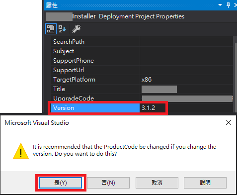

3. 確認 Installer 專案的屬性：`DetectNewerInstalledVersion` 和 `RemovePreviousVersions` 為 True。

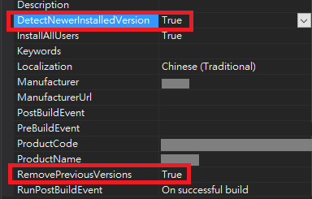

這樣未來更新版本號，只要將版號增加，重複 1 和 2 兩個步驟的設定，安裝新版本時就可以自動覆蓋舊版本檔案，不過啟動安裝前，舊版程式還是要先關閉才行。


## 安裝完成後自動啟動程式

在 MyExeProject 的 Installer Class 加上以下程式碼：

``` csharp {hl_lines=[7,13,14]}
[RunInstaller(true)]
public partial class ProgramInstaller : Installer
{
    public ProgramInstaller()
    {
        InitializeComponent();
        this.Committed += new InstallEventHandler(InstallerCommitted);
    }

    private void InstallerCommitted(object sender, InstallEventArgs e)
    {
        ProcessStartInfo startInfo = new ProcessStartInfo();
        startInfo.FileName = this.Context.Parameters["assemblypath"];
        startInfo.Arguments = "";
        Process.Start(startInfo);
    }
}
```

以上方式啟動執行檔時，會是執行安裝時的權限（系統管理員），如果需要回復到登入時的權限來啟動執行檔，可以改為：

``` csharp {hl_lines=[4,5]}
private void InstallerCommitted(object sender, InstallEventArgs e)
{
    ProcessStartInfo startInfo = new ProcessStartInfo();
    startInfo.FileName = "explorer.exe";
    startInfo.Arguments = this.Context.Parameters["assemblypath"];
    Process.Start(startInfo);
}
```

比較困擾的是，程式無法在安裝程序最後一個畫面關閉後才啟動，而是在安裝進度條跑完後就啟動。不知道有沒有更好的方法？


## 登入系統後自動啟動程式

如果是常用的程式，希望在每次登入電腦後都可以自動啟動，可以在登錄檔 `SOFTWARE\Microsoft\Windows\CurrentVersion\Run` 的位置新增鍵值，名稱可任意取，內容就是放執行檔路徑（可加上引數），使用者登入後系統就會執行檔案。

一樣是在 Committed 時處理：

``` csharp {hl_lines=[13,15,16]}
[RunInstaller(true)]
public partial class ProgramInstaller : Installer
{
    public ProgramInstaller()
    {
        InitializeComponent();
        this.Committed += new InstallEventHandler(InstallerCommitted);
    }

    private void InstallerCommitted(object sender, InstallEventArgs e)
    {
        string path = this.Context.Parameters["assemblypath"];
        string keyName = @"SOFTWARE\Microsoft\Windows\CurrentVersion\Run";

        RegistryKey rk = Registry.LocalMachine.CreateSubKey(keyName);
        rk.SetValue("MyExeProject", $"\"{path}\" -aa -bb", RegistryValueKind.String);
        rk.Close();
    }
}
```

實際寫到登錄檔畫面：

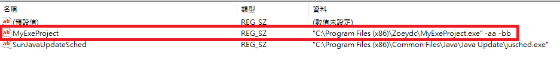

> 如果是 32 位元程式安裝到 64 位元系統，上述程式碼執行後，實際登錄檔會寫在 `SOFTWARE\WOW6432Node\Microsoft\Windows\CurrentVersion\Run`

依照需求，可以設定在 Local Machine 層級或是 Current User 上，如果兩個都設定登入時會啟動兩次，可能需考慮程式會不會產生衝突。

除了 Run 外，還有 RunOnce ，只需要在重新開機後執行一次的，就可以放到 RunOnce（[微軟文件](https://docs.microsoft.com/en-us/windows/win32/setupapi/run-and-runonce-registry-keys)）。


## 建立自解壓縮檔

這將打包壓縮數個檔案成一個可自動解壓縮的執行檔，使其執行時自動解壓縮，同時啟動裡面某個 exe 檔。可以用來建立免安裝檔（可攜式軟體），或者如果有用到 Setup.exe 來預先安裝某些元件時，也可以用這個技巧將 Setup.exe 和 msi 檔合併成一個檔案來釋出。

參考的保哥的「[如何利用 7-zip 設定自動解壓縮並解壓縮後自動啟動程式](https://blog.miniasp.com/post/2009/01/09/How-to-setup-7-zip-to-build-SFX-installer)」就可以產生免安裝檔，簡述方法如下：

1. 到「[7-Zip 官網](https://www.7-zip.org/)」下載 LZMA SDK：現在 SFX 模組和其他的 SDK 都涵蓋在 LZMA SDK 中，我下載的是 19.00 版。解壓縮 bin 底下的 7zr.exe 和 7zSD.sfx，將檔案放到 MyExeProject 的 bin 底下，方便之後要直接加入 Debug 或 Release 整個資料夾內容。

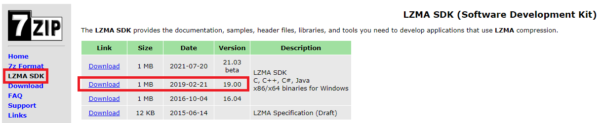

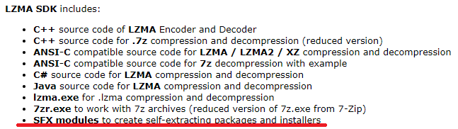

2. 新增文字檔 config.txt，內容包含訊息視窗的標題（Title）、提示內容（BeginPrompt），讓使用者確認後再進行解壓縮，還有解壓縮後要執行的程式路徑（RunProgram）等。範例如下：

```
;!@Install@!UTF-8!

Title="Zoey的程式日常"
BeginPrompt="您要執行 Zoey的測試軟體 嗎？"
RunProgram="Debug\MyExeProject.exe"

;!@InstallEnd@!
```

3. 將 7zr.exe 壓縮檔案及產生可執行檔的指令寫成批次檔（例如 SFXDebug.bat）：

``` cmd
REM 將資料夾 Debug 加入壓縮檔 (檔名 Debug.7z)
7zr.exe a Debug.7z Debug\
REM 將以下檔案從壓縮檔中移除
7zr.exe d Debug.7z Debug\MyExeProject.pdb
7zr.exe d Debug.7z Debug\*.xml
REM 利用 7zSD.sfx、config.txt 和壓縮檔 Debug.7z 產生可執行檔（檔名 Debug.exe）
copy /b 7zSD.sfx + config.txt + Debug.7z Debug.exe
```

4. 在 MyExeProject 專案的「建置後事件」加上指令執行批次檔，參考如下：

``` cmd 
if "$(ConfigurationName)" == "Debug" (
cd "$(ProjectDir)bin"
SFXDebug.bat
) else (
REM 略...
)
```

而在建立免安裝檔過程中，我遇到的狀況是，因為軟體本身不需要以系統管理員權限執行，但是使用 7-Zip 的 `7zSD.sfx` 檔，會需要系統管理員權限，所以需要將下載的 [SFX 檔進行改造](https://stackoverflow.com/questions/17923346/7zip-self-extracting-archive-sfx-without-administrator-privileges)，才能在不須提高權限下就能執行。

7zSD.sfx 檔案改造方式：

1. 新增 `manifest.xml`，與 7zSD.sfx 放在同一目錄下，內容為：

``` xml
<?xml version="1.0" encoding="utf-8"?>
<assembly manifestVersion="1.0" xmlns="urn:schemas-microsoft-com:asm.v1">
  <assemblyIdentity version="1.0.0.0" name="MyApplication.app"/>
  <trustInfo xmlns="urn:schemas-microsoft-com:asm.v2">
    <security>
      <requestedPrivileges xmlns="urn:schemas-microsoft-com:asm.v3">
        <requestedExecutionLevel level="asInvoker" uiAccess="false" />
      </requestedPrivileges>
    </security>
  </trustInfo>

  <compatibility xmlns="urn:schemas-microsoft-com:compatibility.v1">
    <application>
      <!-- Windows Vista -->
      <supportedOS Id="{e2011457-1546-43c5-a5fe-008deee3d3f0}" />
      <!-- Windows 7 -->
      <supportedOS Id="{35138b9a-5d96-4fbd-8e2d-a2440225f93a}" />
      <!-- Windows 8 -->
      <supportedOS Id="{4a2f28e3-53b9-4441-ba9c-d69d4a4a6e38}" />
      <!-- Windows 8.1 -->
      <supportedOS Id="{1f676c76-80e1-4239-95bb-83d0f6d0da78}" />
      <!-- Windows 10 -->
      <supportedOS Id="{8e0f7a12-bfb3-4fe8-b9a5-48fd50a15a9a}" />
    </application>
  </compatibility>
</assembly>
```

2. 假設是用 Visual Studio 2019 進行開發，以命令提示字元執行以下指令：

``` cmd
call "C:\Program Files (x86)\Microsoft Visual Studio\2019\Community\VC\Auxiliary\Build\vcvarsall.bat" x86
mt.exe -manifest manifest.xml -outputresource:"7zSD.sfx;#1"
```

7zSD.sfx 即修改完成。

> 可執行檔自解壓縮後，檔案會暫存在 `%USERPROFILE%\AppData\Local\Temp` 目錄下，以 `7zS` 開頭共 11 碼的資料夾中（例如：7zSC6918AEE）。


## 安裝後無法解除安裝程式

有嘗試過改造建置好的 msi 檔，結果安裝完後卻無法解除安裝，幸好網路上找到了[一個方法](https://superuser.com/questions/570598/how-to-force-uninstall-a-software-that-is-installed-by-msi-package)可以處理這個狀況（除了用現有的強制移除安裝軟體外），也順便瞭解了 Windows 系統如何記錄「新增移除程式」（或「程式和功能」）清單。

> <mark>以下牽涉到登錄檔的操作，請謹慎小心注意！</mark>

1. 安裝程式的資訊記錄在 `HKLM\SOFTWARE\Microsoft\Windows\CurrentVersion\Uninstall\` 或 WOW6432Node 的相對路徑的登錄檔中，各軟體的機碼可能以 GUID 或軟體名稱呈現，各個機碼下可找到鍵值 `DisplayName` 就是顯示在清單上的名稱，`DisplayVersion` 是軟體版本等。

例如 Microsoft SQL Server 2017 Setup 在應用程式清單畫面為（Windows 10）：

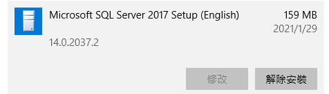

登錄檔資訊為：

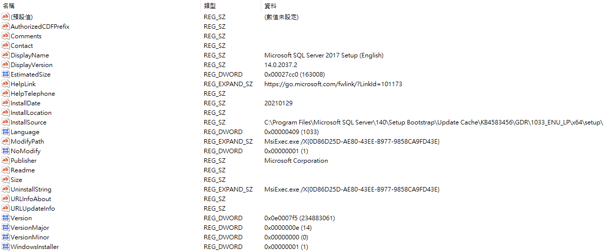

在清單使用「修改」或「解除安裝」功能時，就是分別執行鍵值 `ModifyPath` 或 `UninstallString` 所存的指令。

以 Setup Project 專案製作的安裝檔，安裝後其路徑機碼 GUID 就是屬性中的 ProductCode，ProductName 為 DisplayName，Version 為 DisplayVersion，Author 為 Contact，Manufacturer 為 Publisher 等。

> **在此可以將欲移除的軟體的機碼含子機碼整個刪除，這時在應用程式清單中就不會再出現這個軟體。**
> 例如將 `HKLM\SOFTWARE\Microsoft\Windows\CurrentVersion\Uninstall\{GUIDXXXX-XXXX-XXXX-XXXX-XXXXXXXXXXXX}` 刪除

2. 接下來將上述的 GUID 重組，以 `-` 做為區隔，前三個部份字串進行反轉，後兩個部分每兩個字符順序調換，例如 `{0D86D25D-AE80-43EE-B977-9858CA9FD43E}` 會重組成 `{D52D68D0-08EA-EE34-9B77-8985ACF94DE3}`，然後去除符號部分，`D52D68D008EAEE349B778985ACF94DE3`。

到另外一個登錄檔路徑 `HKLM\SOFTWARE\Classes\Installer\Products` 找到這個重組的機碼（不須轉換到 WOW6432Node），**比對 ProductName 無誤，即可刪除此機碼**。

參考 Microsoft SQL Server 2017 Setup 在此的登錄檔資訊為：

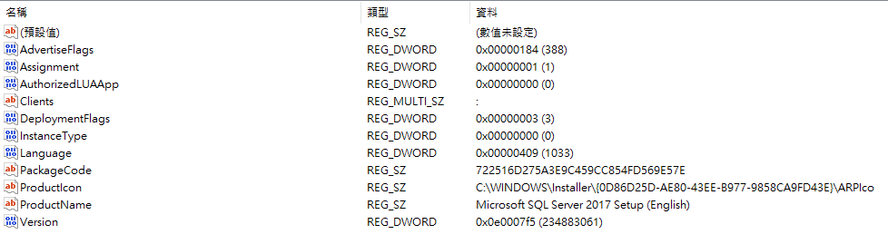

最後刪除此程式執行檔目錄（例如 `C:\Program Files (x86)\MyExeProject`），完成整個軟體的移除。

當然，如果這個軟體安裝時有寫登錄檔或建立捷徑的話，就要另外刪除。

-----------------------

以上為建立安裝檔時可能用到的小技巧，與你分享😎


##### 相關連結：

1. [[VITOの學習筆記] 建立Installer](http://vito-note.blogspot.com/2012/02/installer.html)
1. [在Visual Studio將Windows Service打包成安裝檔](https://catchtest.pixnet.net/blog/post/30397914-%E5%9C%A8visual-studio%E5%B0%87windows-service%E6%89%93%E5%8C%85%E6%88%90%E5%AE%89%E8%A3%9D%E6%AA%94)
1. [[stack overflow] Installer won't overwrite existing app](https://stackoverflow.com/questions/6310908/installer-wont-overwrite-existing-app)
1. [[CODE PROJECT] Launching Your Application After Install using Visual Studio 2005](https://www.codeproject.com/Articles/19560/Launching-Your-Application-After-Install-using-Vis)
1. [[Micorsoft Docs] Run and RunOnce Registry Keys](https://docs.microsoft.com/en-us/windows/win32/setupapi/run-and-runonce-registry-keys)
1. [[WILL保哥] 如何利用 7-zip 設定自動解壓縮並解壓縮後自動啟動程式](https://blog.miniasp.com/post/2009/01/09/How-to-setup-7-zip-to-build-SFX-installer)
1. [7-Zip SDK](https://www.7-zip.org/7z.html)
1. [[stack overflow] 7zip Self Extracting Archive (SFX) without administrator privileges](https://stackoverflow.com/questions/17923346/7zip-self-extracting-archive-sfx-without-administrator-privileges)
1. [[StackExchange] How to force uninstall a software that is installed by MSI package?](https://superuser.com/questions/570598/how-to-force-uninstall-a-software-that-is-installed-by-msi-package)


